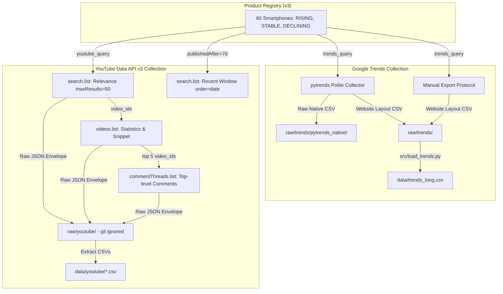

# Formal Dataset Documentation

**Project:** Viral Product Intelligence: Early Detection and Prediction of Consumer Demand Surges Using Multi-Source Signals  
**Work Item:** SCRUM-10 (Sprint 0 / Review 1)  
**Author:** Mounik Sai (`mouniksai9@gmail.com`)  
**Date:** 2026-10-04  
**Status:** Approved / Formal Baseline  

---

## 1. Executive Summary & Purpose

This document provides the definitive, formal dataset documentation for the **Viral Product Intelligence** research initiative. The objective of this project is to detect early consumer interest signals and predict demand surges for consumer electronics prior to sales realization. 

The primary target domain consists of **60 smartphones** in the Indian consumer market across multiple lifecycle stages. The dataset integrates two distinct signal modalities:
1. **Macro Search Demand Signal:** Daily search interest indices from **Google Trends** (269-day continuous retrospective window).
2. **Social Engagement & Content Velocity Signal:** Video metadata, engagement metrics, and top-level user commentary from the **YouTube Data API v3** (structured snapshots and rolling 7-day upload activity windows).

This document details:
- The product registry taxonomy and selection rationale.
- End-to-end data collection methodologies and protocols.
- Source-specific boundaries, API constraints, and behavioral limitations.
- Cleaning, normalization, and deduplication specifications.
- Comprehensive data dictionary and table schemas.
- Data integrity, governance, and privacy compliance.

---

## 2. Product Registry & Target Scope

### 2.1 Scope & Demographics
The dataset monitors **60 smartphone models** marketed and sold in India. The registry was constructed by domain analysts and validated against Indian retail and launch archives (including Flipkart, Amazon India, GSMArena, and official manufacturer press releases).

- **Geographic Focus:** India (`IN`).
- **Brand Representation (13 Brands):** Apple (8), Samsung (8), OnePlus (6), Xiaomi (4), Redmi (6), Poco (5), Realme (6), Vivo (5), iQOO (5), Motorola (4), Google (2), Nothing (3), Infinix (2).
- **Product Classification:**
  - **RISING (24 models / 40%):** Newly launched devices (since mid-2026) or imminent market entries exhibiting rapid buzz generation.
  - **STABLE (24 models / 40%):** Established, mature market devices maintaining steady search and video engagement baselines.
  - **DECLINING (12 models / 20%):** Older or superseded product generations displaying decaying engagement.

### 2.2 Active Registry Versioning
The project maintains strict registry immutability. Historical registry versions are preserved for reproducibility:

| Version | File | Active Date | Description |
|---|---|---|---|
| **v1** | `data/products.csv` | 2026-10-03 | Baseline 60-product registry; standard query pattern `<trends_query> review`. |
| **v2** | `data/products_v2.csv` | 2026-10-03 | Experimental narrowing using YouTube `-term` exclusion operators for P044 and P057. |
| **v3 (Active)** | `data/products_v3.csv` | 2026-10-03 | **Active production registry**. Reverted P044 to v1 query (exclusions lowered precision from 56% to 44%); retained v2 exclusion for P057 (improved precision from 58% to 64%). |

---

## 3. Data Collection Methodologies

### 3.1 Google Trends Collection

#### Parameters & Specifications
- **Search Engine / Mode:** Web Search (`gprop=""`).
- **Category:** All categories (`cat=0`).
- **Geo-targeting:** India (`geo="IN"`).
- **Time Window:** Fixed 269-day span: **2026-01-08 to 2026-10-03** (inclusive).
- **Granularity:** Daily search interest index. (Google Trends switches from daily to weekly aggregation when query windows exceed 269 days; this exact 269-day boundary preserves maximum continuous daily resolution).
- **Metric Definition:** Relative Search Interest on an integer index from `0` to `100`, normalized against the single highest peak day for that specific query within the selected timeframe.

#### Collection Implementation
1. **Automated Pipeline (`src/collect_trends_pytrends.py`):**
   - Utilizes `pytrends==4.9.2` interfacing with Google Trends web endpoints.
   - Strictly enforces polite pacing: randomized pauses of 30–75 seconds between queries.
   - Built-in exponential backoff (60s, 120s, 240s) upon encountering HTTP 429 (Too Many Requests), halting immediately after 3 consecutive failures.
   - Dual output persistence: native responses stored in `raw/trends/pytrends_native/` and website-layout identical CSVs in `raw/trends/<product_id>_<date>.csv`.
   - Operations tracked in `data/trends_collection_manifest.csv` and `data/collection_log.csv`.
2. **Manual Web Export Standard (`docs/trends_export_guide.md`):**
   - Protocol for manual CSV downloads via `trends.google.com` using identical timeframes, categories, and geographic tags.
3. **Loader Validation (`src/load_trends.py`):**
   - Enforces uniform header validation, search query alignment, daily date ranges, and identical calendar boundaries across all 60 products before assembling `data/trends_long.csv`.

### 3.2 YouTube Data API v3 Collection

#### Authentication & Budget Governance
- Authenticated via official Google Cloud API key (`YOUTUBE_API_KEY` stored exclusively in git-ignored `.env`).
- Monitored by `QuotaTracker` in `src/collect_youtube.py`, logging per-request consumption to `data/youtube/quota_usage.csv`.
- Adheres to Google's daily quota allotment (10,000 quota units / 100 `search.list` calls per Pacific Time day). Default safety limits: 9,000 units and 90 search calls.

#### Collection Passes
1. **Main Pass (Relevance Snapshot):**
   - `search.list`: Query `<youtube_query>`, `regionCode=IN`, `relevanceLanguage=en`, `type=video`, `order=relevance`, `maxResults=50`. (Cost: 1 unit + 1 search call).
   - `videos.list`: Batched request (`part=snippet,statistics`) for up to 50 video IDs returned by search. Extracts titles, publish dates, channel IDs, view counts, like counts, and comment counts. (Cost: 1 unit).
   - `commentThreads.list`: Target the top 5 most-viewed videos per product. Fetches up to 100 top-level comments per video (`order=relevance`, `textFormat=plainText`). Caps total comments per product at 500. (Cost: 1 unit per video, up to 5 units).
   - **Total Main Pass Unit Cost per Product:** ~7 units + 1 search call.
2. **Recent Pass (Velocity / Upload Window):**
   - `search.list`: `publishedAfter = run_time - 7 days`, `publishedBefore = run_time`, `order=date`, `regionCode=IN`, `maxResults=50`.
   - Records upload frequency (`videos_published_7d`), on-target model uploads (`videos_7d_on_target`), and result cap indicators (`cap_hit`). (Cost: 1 unit + 1 search call).

---

## 4. Source Constraints & Critical Boundaries

| Dimension | Google Trends | YouTube Data API v3 |
|---|---|---|
| **Normalization / Scale** | Relative index (0–100) per product; non-comparable across absolute product volumes. | Cumulative lifetime counts (views, likes, comments) as of snapshot timestamp. |
| **Sampling & Truncation** | Sampled query index. Daily granularity capped at 269 days. | Search results hard-capped at 50 videos; comment extraction capped at top 5 videos × 100 comments. |
| **Thresholding & Zeros** | pytrends truncates `<1` interest to integer `0`. Manual exports record `<1` as 0.5 with flag. | Missing values (hidden likes/disabled comments) preserved as null, never zeroed. |
| **Query Contamination** | Broad query matching captures sibling variants (e.g., "Edge 70" captures "Edge 70 Fusion"). | Relevance search returns sibling variants. Evaluated via `on_target_share`; <60% flagged. |
| **Provisional Data** | Most recent day (`2026-10-03`) flagged `is_provisional=True` due to Google re-indexing. | Snapshot data is permanent for that timestamp; historical time-series requires recurrent runs. |
| **Temporal Overlap** | Retrospective continuous daily window (269 days). | Point-in-time snapshot (initial overlap: 10 pilot product-days = 0.06%). |
| **API Quotas** | Unofficial endpoint rate limits (HTTP 429); managed via polite pacing. | Strict 10,000 units/day + 100 search.list calls/day ceiling. |

### 4.1 Detailed Limitation Explanations

1. **Non-Comparability of Trends Magnitudes:**
   Because each product’s Trends time series is independently rescaled so that its highest single day equals 100, a value of 80 for an entry-level smartphone does *not* indicate higher absolute search volume than 50 for a flagship device. Downstream models must rely on rate-of-change, acceleration, relative peak ratios, and percentage differences rather than cross-sectional absolute levels.
2. **Sibling Model Query Bleed (On-Target Share):**
   In the Indian smartphone market, manufacturers frequently release families of devices (e.g., Redmi Note 13, Redmi Note 13 Pro, Redmi Note 13 Pro+). A general search for "Redmi Note 13 review" returns videos reviewing all sibling variants. Using `src/title_match.py`, every video title is parsed to check whether it specifically isolates the target model. 
   - 4 products in the active 60-product registry demonstrate an on-target share below 60%: P015 (48%), P009 (50%), P012 (56%), and P028 (56%).
   - P044 (Motorola Edge 70) exhibits borderline on-target share (56% on 2026-10-03; 66% on 2026-10-04).
3. **Comment Scope & Language Biases:**
   - YouTube comments are restricted to top-level comments on the top 5 videos. Thread replies are excluded by design to prioritize primary viewer reactions.
   - Text filtering detects non-Latin scripts (`likely_non_english`). However, code-mixed Indian English and romanized Indic vernaculars ("Hinglish", transliterated Hindi/Tamil) are composed in Latin characters and therefore classified as Latin script. Downstream NLP pipelines must account for vernacular sentiment syntax.
4. **Missing E-Commerce Ground Truth:**
   The project explicitly does not track daily e-commerce sales volumes, pricing variations, or seller ratings from portals like Amazon India or Flipkart. These platforms do not provide public, free APIs for academic use, and commercial automated scraping is prohibited by repository guidelines and terms of service.

---

## 5. Preprocessing & Data Cleaning Standards

All raw inputs in `raw/` and base snapshot extracts in `data/youtube/` remain immutable. Transformations are executed deterministically by `src/clean_trends.py`, `src/clean_youtube.py`, and `src/build_aligned.py`, writing exclusively to `data/processed/`.

### 5.1 Cleaning Invariants
1. **Idempotency:** Re-executing cleaning scripts produces identical outputs byte-for-byte.
2. **Preservation of Outliers:** Genuine spikes and demand surges are the primary phenomenon of interest. Outliers are never winsorized, clipped, or removed.
3. **Null vs Zero Separation:** Unobserved metrics, missing values, or disabled features (e.g., hidden video likes) remain null (`NaN`/empty string) and are never imputed as zero.
4. **Deduplication Priority:** Deduplication is conducted on primary composite keys (`product_id, date` or `snapshot_date, product_id, video_id`). The first record observed chronologically is retained.
5. **Active Query Isolation:** YouTube cleaning filters records strictly to those generated under the active registry version (`v3`). Earlier experimental queries (e.g., v2 exclusion tests) are segregated into evidence reports and omitted from downstream tables.

---

## 6. Table Schemas & Data Dictionary

### 6.1 `data/processed/aligned_daily.csv` (16,140 rows)
Primary unified modeling dataset joining the Google Trends daily index with corresponding YouTube snapshot metrics.

| Column | Type | Nullable | Description & Constraints |
|---|---|---|---|
| `product_id` | String | No | Unique product identifier (`P001`–`P060`). |
| `date` | Date | No | Calendar date (`YYYY-MM-DD`). |
| `product_name` | String | No | Commercial smartphone marketing name. |
| `brand` | String | No | Marketing brand in India. |
| `category` | String | No | Target product segment (`smartphone`). |
| `product_type` | String | No | Lifecycle classification (`RISING`, `STABLE`, `DECLINING`). |
| `search_interest` | Float | No | Google Trends index (0.0 to 100.0). |
| `is_below_threshold` | Boolean | No | True if original manual export was `<1` (stored as 0.5). |
| `is_zero` | Boolean | No | True if search interest equals 0. |
| `trends_observed` | Boolean | No | True if Google Trends data exists for this product-day. |
| `youtube_observed` | Boolean | No | True if YouTube main-pass snapshot was conducted on this date. |
| `youtube_recent_observed`| Boolean | No | True if YouTube recent-window pass was conducted on this date. |
| `is_provisional` | Boolean | No | True for 2026-10-03 (Google Trends partial collection boundary). |
| `zero_share_product` | Boolean | No | True if product has >50% zero-interest days across window. |
| `low_signal_product` | Boolean | No | True if product has >50% zero-interest days (same as zero_share_product). |
| `video_result_count` | Float | Yes | Relevance search result count (capped at 50; not a volume signal). |
| `video_views_total` | Float | Yes | Sum of lifetime views across top 50 relevance-ranked videos. |
| `video_comments_total` | Float | Yes | Sum of comment counts across top 50 relevance-ranked videos. |
| `videos_on_target` | Float | Yes | Number of videos specifically matching the exact model title. |
| `views_on_target_total`| Float | Yes | Total views of on-target videos. |
| `comments_on_target_total`| Float | Yes | Total comments on on-target videos. |
| `on_target_share` | Float | Yes | Ratio of on-target videos to total videos found (`videos_on_target / video_result_count`). |
| `low_on_target_share` | Boolean | Yes | True if `on_target_share` is below 0.60 (60%). |
| `videos_published_7d` | Float | Yes | Recent pass: videos published within past 7 days. |
| `videos_7d_on_target` | Float | Yes | Recent pass: exact-model videos published within past 7 days. |
| `recent_cap_hit` | Boolean | Yes | True if recent pass hit the 50-video search cap. |

### 6.2 Secondary Processed Tables

1. **`data/processed/trends_clean.csv` (16,140 rows):** Cleaned Trends daily time series containing `product_id`, `date`, `search_interest`, `is_below_threshold`, `is_zero`, `granularity`, `source_file`, `collection_date`.
2. **`data/processed/youtube_videos_clean.csv` (3,500 rows):** Granular video records containing `video_id`, `snapshot_date`, `product_id`, `title`, `channel_id`, `published_at`, `view_count`, `like_count`, `comment_count`, `query_version`.
3. **`data/processed/youtube_comments_clean.csv` (32,215 rows):** Granular viewer comments containing `video_id`, `comment_id`, `snapshot_date`, `product_id`, `text`, `like_count`, `published_at`, `is_emoji_only`, `likely_non_english`, `query_version`.
4. **`data/processed/full_report.csv` (60 rows):** Product-level audit summary detailing row counts, zero-shares, peak/mean interest, on-target ratios, recent upload counts, usability status (`usable = True` for 42 products), and issues log.

---

## 7. Data Governance, Ethics & Privacy

- **Personally Identifiable Information (PII) Scrubbing:**
  In compliance with academic research ethics and YouTube Developer Policies, viewer display names, author channel URLs, and commenter profile image links are stripped during extraction. Only comment texts and randomized alphanumeric comment IDs are preserved.
- **Credential Isolation:**
  Google Cloud API credentials reside strictly in local `.env` files and are never committed to version control. All exception traces pass through `common.redact()` to sanitize potential credential leaks.
- **Repository Public Safety:**
  The public repository tracks aggregated metrics, cleaned tabular snapshots, and audit documentation. Raw JSON payloads (`raw/youtube/*.json`) are git-ignored to prevent inadvertent metadata exposure.
