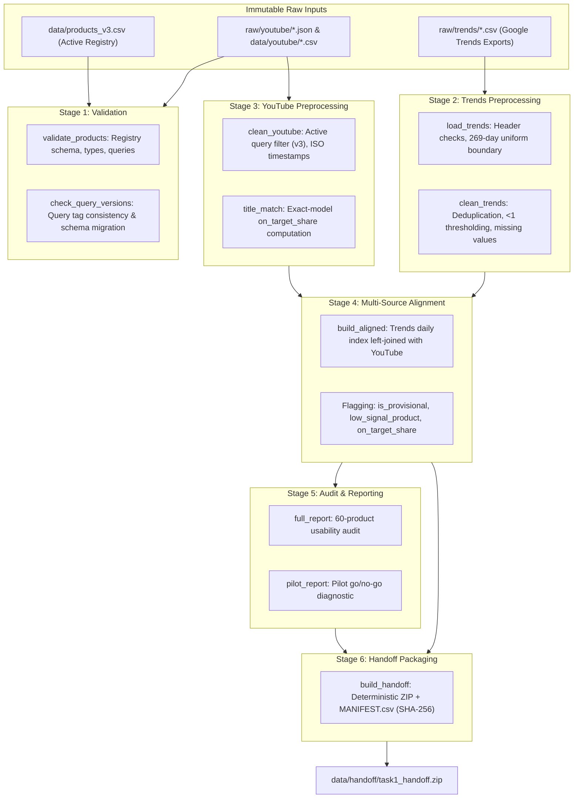

# Consolidated Preprocessing Pipeline Architecture

**Project:** Viral Product Intelligence: Early Detection and Prediction of Consumer Demand Surges Using Multi-Source Signals  
**Work Item:** SCRUM-19 (Sprint 0 / Review 1)  
**Author:** Mounik Sai (`mouniksai9@gmail.com`)  
**Sprint:** SCRUM Sprint 0 / Review 1  
**Status:** Approved / Consolidated Production Pipeline  

---

## 1. Overview & Architectural Motivation

Prior to this work item, data preprocessing and preparation were distributed across nine independent scripts (`validate_products.py`, `check_query_versions.py`, `load_trends.py`, `clean_trends.py`, `clean_youtube.py`, `build_aligned.py`, `full_report.py`, `pilot_report.py`, and `build_handoff.py`). Orchestration previously relied on platform-specific bash scripts (`run_after_reset.sh`) that mixed remote API fetching with local transformations and failed on non-Unix environments.

**SCRUM-19** consolidates the entire data preparation lifecycle into a unified, cross-platform engine:
- **Module:** `src/consolidate_pipeline.py`
- **CLI Command:** `python src/consolidate_pipeline.py`
- **Programmatic API:** `run_pipeline(paths, stages, dry_run, quiet, continue_on_error)`
- **Cross-Platform:** Full native support for Windows PowerShell, macOS, and Linux without shell dependencies.

---

## 2. End-to-End Data Flow Diagram



---

## 3. Stage Specifications & Contracts

### Stage 1: `validation`
- **Components:** `src/validate_products.py`, `src/check_query_versions.py`
- **Inputs:** `data/products*.csv`, `data/youtube/*.csv`, `raw/youtube/` (when present).
- **Invariants:**
  1. Validates all registry versions (`products.csv`, `products_v2.csv`, `products_v3.csv`) for schema compliance, unique sequential IDs, standard query formatting, valid lifecycle categories (`RISING`, `STABLE`, `DECLINING`), and brand spellings.
  2. Enforces cross-version query immutability (only `youtube_query` may change between versions).
  3. Verifies that all local snapshot extracts have backfilled `query_version` tags. When raw JSON files are present (on the collecting machine), verifies query equality against the active registry.
- **Outputs:** Console audit, `data/youtube/raw_file_index.csv`.

### Stage 2: `trends_clean`
- **Components:** `src/load_trends.py`, `src/clean_trends.py`
- **Inputs:** `raw/trends/<product_id>_<date>.csv`
- **Invariants:**
  1. Loads and validates all 60 product exports; enforces uniform 269-day date range (**2026-01-08 to 2026-10-03**) and daily granularity.
  2. Writes `data/trends_long.csv`.
  3. Isolates latest exports per product; deduplicates on `(product_id, date)`.
  4. Preserves `<1` search interest as `0.5` with `is_below_threshold = true`.
  5. Never removes outliers; reports calendar gaps without forward filling.
- **Outputs:** `data/processed/trends_clean.csv` (16,140 rows), `data/processed/cleaning_report_trends.csv`.

### Stage 3: `youtube_clean`
- **Components:** `src/clean_youtube.py`, `src/title_match.py`
- **Inputs:** `data/youtube/videos_snapshot.csv`, `comments_snapshot.csv`, `product_daily.csv`, `recent_window_daily.csv`
- **Invariants:**
  1. Filters records strictly to the active registry query version (`v3`), excluding experimental or superseded query rows into audit logs.
  2. Standardizes timestamps to ISO 8601 UTC.
  3. Deduplicates on primary keys (`snapshot_date, product_id, video_id/comment_id`), keeping the earliest collected observation.
  4. Keeps null and zero separate (empty string for disabled statistics or hidden likes, never imputed as 0).
  5. Computes exact-model metrics: `videos_on_target`, `views_on_target_total`, `comments_on_target_total`, `on_target_share`, and flags `low_on_target_share` (<60%).
  6. Cleans comment text and tags `is_emoji_only` and `likely_non_english`.
- **Outputs:** `data/processed/youtube_videos_clean.csv` (3,500 rows), `youtube_comments_clean.csv` (32,215 rows), `youtube_product_daily_clean.csv` (70 rows), `youtube_recent_window_clean.csv` (10 rows), `cleaning_report_youtube.csv`, `docs/cleaning_summary_youtube.md`.

### Stage 4: `alignment`
- **Components:** `src/build_aligned.py`
- **Inputs:** `trends_clean.csv`, `youtube_product_daily_clean.csv`, `youtube_recent_window_clean.csv`, `products_v3.csv`
- **Invariants:**
  1. Constructs a complete daily index across all 60 products × 269 days (16,140 rows).
  2. Executes a left join on `(product_id, date)` with YouTube snapshot and recent-pass observations.
  3. Populates observation flags: `trends_observed`, `youtube_observed`, `youtube_recent_observed`.
  4. Flags `is_provisional` on the latest date (`2026-10-03`).
  5. Flags zero-heavy series: `zero_share_product` and `low_signal_product` (>50% zero days).
  6. Imputes no values across unobserved dates (no forward fill).
- **Outputs:** `data/processed/aligned_daily.csv` (16,140 rows), `data/processed/alignment_report.csv`.

### Stage 5: `reporting`
- **Components:** `src/full_report.py`, `src/pilot_report.py`
- **Inputs:** `aligned_daily.csv`, `trends_clean.csv`, `youtube_*_clean.csv`
- **Invariants:**
  1. Evaluates all 60 products for modeling usability: `usable = True` requires `not low_signal_product` and `not low_on_target_share` (42 usable products).
  2. Calculates 7-day rolling means excluding provisional dates.
  3. Generates pilot go/no-go diagnostic.
- **Outputs:** `data/processed/full_report.csv` (60 rows), `docs/full_report.md`.

### Stage 6: `handoff`
- **Components:** `src/build_handoff.py`
- **Inputs:** `aligned_daily.csv`, `trends_clean.csv`, `youtube_videos_clean.csv`, `youtube_comments_clean.csv`, `full_report.csv`, `docs/handoff_task1.md`
- **Invariants:**
  1. Bundles clean modeling tables into a deterministic, compressed ZIP archive.
  2. Computes SHA-256 hashes and uncompressed byte lengths for each artifact.
  3. Embeds `MANIFEST.csv` inside the archive.
  4. Fixes zip member timestamps to ensure reproducible bit-identical builds.
- **Outputs:** `data/handoff/task1_handoff.zip`.

---

## 4. Usage & Execution Guide

### Command-Line Interface (CLI)

```bash
# Run complete end-to-end consolidated pipeline
python src/consolidate_pipeline.py

# Dry-run inspection (verifies preconditions without execution)
python src/consolidate_pipeline.py --dry-run

# Run specific stages only
python src/consolidate_pipeline.py --stages validation trends_clean youtube_clean

# Skip validation or handoff packaging
python src/consolidate_pipeline.py --skip-validation --skip-handoff

# Quiet mode (suppresses progress logs, outputs final summary table)
python src/consolidate_pipeline.py --quiet

# Continue execution even if an upstream stage fails
python src/consolidate_pipeline.py --continue-on-error
```

### Programmatic Python API

```python
import config
from consolidate_pipeline import run_pipeline

# Execute all stages
result = run_pipeline(paths=config.PATHS)

if result.success:
    print(f"Pipeline succeeded in {result.total_duration_seconds:.2f}s")
    for stage, res in result.stages.items():
        print(f"  {stage}: {res.status} ({res.duration_seconds:.2f}s)")
    print(f"Aligned rows: {result.summary.get('aligned_daily_rows', 0):,}")
else:
    print("Pipeline encountered errors during execution.")
```

---

## 5. Verification & Audit Trail

The consolidated pipeline has been verified under unit tests (`tests/test_consolidate_pipeline.py`) and executed against the full production dataset.

| Metric | Target | Consolidated Pipeline Result | Status |
|---|---|---|---|
| **End-to-End Runtime** | < 10 seconds | **~2.2 seconds** | PASS |
| **All-Product Alignment** | 16,140 rows | **16,140 rows (60 products x 269 days)** | PASS |
| **Clean Video Snapshot** | 3,500 rows | **3,500 rows** | PASS |
| **Clean Comment Snapshot**| 32,215 rows | **32,215 rows** | PASS |
| **Handoff Packaging** | Deterministic SHA-256 | **`task1_handoff.zip` (2.34 MB)** | PASS |
| **Test Suite Coverage** | 100% pass | **112 / 112 tests passing** | PASS |
